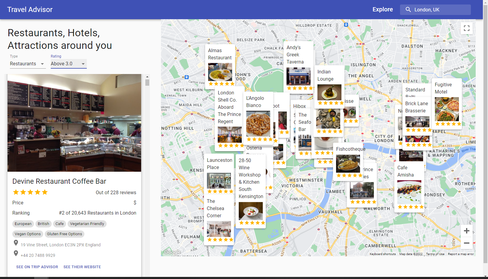

# Travel Advisor
### Build and Deploy an advanced Travel Companion Application using Google Maps. With Geolocation, Google Maps API, Searching for places, Fetching restaurants, hotels and attractions based on location from specialized Rapid APIs, data filtering...
<p align="center"><p>

This project was bootstrapped with [Create React App](https://github.com/facebook/create-react-app).
#### Credit to Tutorial created in collaboration with Enyel Sequeira, taught by JavaScript Mastery.

## Dependencies
``` npm i ```
(see package.json for more)
## Execution
``` npm start ```


## Components
All sources from travel advisor from https://rapidapi.com/apidojo/api/travel-advisor
### Header
Navigation search bar that allows user to enter a location for searching
### List
List of restaurants, hotels, and attractions with detailed information
### Map
Google map interface where the api key should be in 'keys.json' that is in a folder named 'sensitive'
Enable Map and Places API at google cloud console.
### Detail
User-friendly location card appear on the map for better visuals
